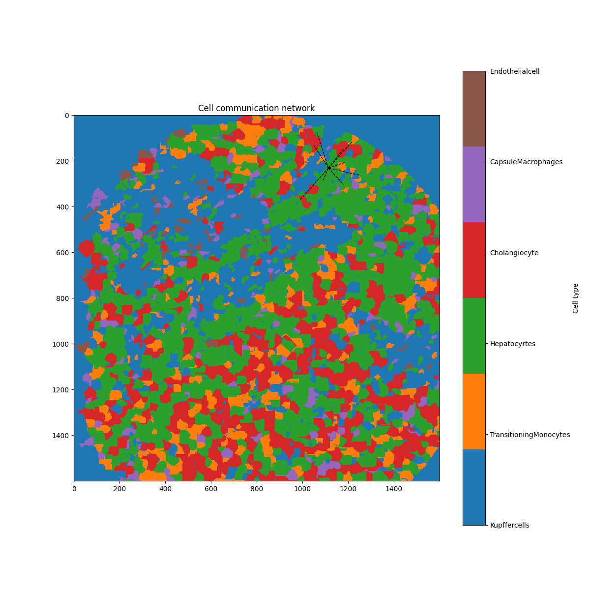

# GraphCIM
This is the official repository of paper **Inference of cell interactions and mapping of communication for single-cell spatial transcriptomes with GraphCIM**.

## System requirements
### Operating system
The software has been tested on the Ubuntu Linux 20.04 system.

### Software requirements
- python 3.9
- torch
- scipy
- pandas
- numpy 
- scikit-learn
- matplotlib

Install all dependencies using
```
pip install -r requirements.txt
```

## Quick Start
An example is provided for one mouse liver section generated from the seq-scope platform.

### Example
```bash
python train.py  --exp ./data/seq-scope/count.csv --adj ./data/seq-scope/adj.csv --cell_pixel ./data/seq-scope/spot2cell.txt --cell_type ./data/seq-scope/cell_type.csv --coord ./data/seq-scope/coord.csv
```

### Input
The input file contains gene expression data, information on positive samples of intercellular interactions, cellular pixel data, cell type classifications, and coordinates for the centroids of the cells. We provide the code for correcting intercellular distances.
```bash
python convex_full_smallest_enclosing.py
```
### Output
The output is the result of the interaction between cells

### Visualization
We provide code for visualizing the results of intercellular interactions.



### Processing large-scale data
GraphCIM can process large-scale spatial data by splitting the provided section into patches, and process the data patch by patch. This makes the prediction on very large datasets feasible on normal computers. The user can set the patch size in the parameters.

## Arguments
```
--exp                   str         Input gene expression data path.                 
--adj                   str         Input adjacency matrix data path. 
--cell_pixel            str         Input pixel of cell data path.             
--cell_type             str         Input cell type data path.              
--coord                 str         Input coord data path.        
--seed                  int         Random seed.                                       Default is 0. 
--epoch                 int         Number of epochs to train.                         Default is 30.
--K                     int         Number of samples for importance                   Default is 0.               
--J                     int         Number of samples for variational distribution q.  Default is 1.
--eps                   float       Eps.                                               Default is 0.
--gpu-id                int         GPU ID.                                            Default is 0.
--batch                 int         Use batch processing.                              Default is 0.
--filename              str         Filename for recording results.                    Default is result.txt.            
```